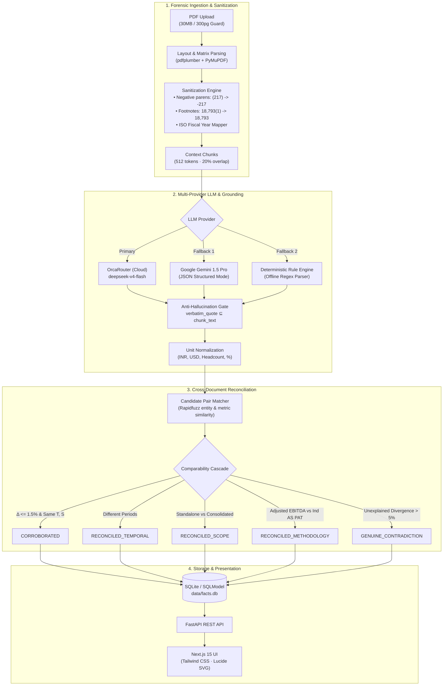

# ClaimsMap — Cross-Document Fact Verification & Reconciliation Layer


> **Superjoin Engineering Hiring Assignment — Fact Knowledge Layer**  
> Built by **Om Srivastava** (VIT Chennai · B.Tech CSE Data Science)

**ClaimsMap** is an enterprise-grade document intelligence platform designed to extract structured numerical and semantic claims from corporate annual reports, earnings releases, prospectuses, and central bank macro reports. 

Every claim is strictly anchored with **verbatim source quotes**, normalized across currency and accounting units, and cross-reconciled using a **comparability-gated reconciliation engine** that separates superficial notation differences from genuine factual contradictions.

---

## Repository & Local Access

| Resource | Link | Description |
|---|---|---|
| **GitHub Repository** | [IronLad123/claimsmap](https://github.com/IronLad123/claimsmap) | Full source code, test suites, and starter PDF datasets |
| **Local Web UI** | `http://localhost:3000` | Next.js App Router frontend with real-time fact inspection |
| **API Docs (Swagger)** | `http://localhost:8000/docs` | Interactive OpenAPI documentation for all endpoints |
| **Health Check** | `http://localhost:8000/api/health` | Service status, active LLM provider, and model information |

---

## Architectural Pipeline



---

## Core Benchmark Showcase Scenarios

The system is pre-seeded and tested against real-world documents from **Delhivery Limited**, the **Reserve Bank of India (RBI)**, and the **International Monetary Fund (IMF)**.

### Case 1: Corroborated Facts Across Formats
* **Source A (FY24 Annual Report, p. 22)**: Consolidated Revenue from Operations of **₹81,415.38 Million**.
* **Source B (Q4 FY24 Earnings Deck, p. 9)**: Revenue from Services of **₹8,142 Crore**.
* **Reconciliation Verdict**: `CORROBORATED` (Confidence: 0.99)
* **Mathematical Proof**: 
  $$\text{₹81,415.38 Million} \div 10 = \text{₹8,141.54 Crore} \approx \text{₹8,142 Crore}$$
  Mathematical delta $\Delta = 0.0056\%$ (well below the $1.5\%$ corporate rounding threshold).

---

### Case 2: Genuine Factual Contradiction
* **Source A (RBI Annual Report 2024-25, p. 12)**: India's Forex Reserves provide **11 months** of import cover (as of March 2025).
* **Source B (IMF Article IV Report 2025, p. 12)**: India's Forex Reserves provide **over 8 months** of import cover.
* **Reconciliation Verdict**: `GENUINE_CONTRADICTION` (Delta: 27.27%)
* **Root-Cause Analysis**: Irreconcilable definitional conflict. The RBI denominator measures historical merchandise-only imports, whereas the IMF uses a forward-looking 12-month goods and services denominator. Without an explicit cross-statement reconciliation table, these two figures contradict.

---

### Case 3A: Apparent Contradiction Reconciled by Scope
* **Source A (FY24 Annual Report, p. 22)**: Standalone Revenue from Operations = **₹74,540.82 Million**.
* **Source B (FY24 Annual Report, p. 22)**: Consolidated Revenue from Operations = **₹81,415.38 Million**.
* **Reconciliation Verdict**: `RECONCILED_SCOPE` (Confidence: 0.95)
* **Accounting Perimeter**: Under Indian Accounting Standards (Ind AS), standalone reports reflect only the parent entity (*Delhivery Limited*), while consolidated figures include subsidiaries (*Spoton Logistics*), adding **₹6,874.56 Million** in subsidiary freight revenues.

---

### Case 3B: Apparent Contradiction Reconciled by Methodology
* **Source A (Q4 FY24 Earnings Deck, p. 4)**: Full-Year Adjusted EBITDA of **+₹76 Crore** (*"EBITDA Profitable"*).
* **Source B (FY24 Annual Report, p. 22)**: Consolidated Statutory Loss for the year (PAT) of **-₹2,491.86 Million**.
* **Reconciliation Verdict**: `RECONCILED_METHODOLOGY` (Confidence: 0.92)
* **Financial Logic**: Adjusted EBITDA is a non-GAAP cash operating profit proxy that excludes depreciation, right-of-use asset amortisation (Ind AS 116), finance costs, and share-based compensation (ESOPs). Statutory PAT reflects bottom-line accounting reality after all non-cash amortisation. Both statements are accurate within their respective accounting frameworks.

---

## Defensive Engineering: PDF Parsing Edge Cases

Standard off-the-shelf PDF parsers routinely corrupt financial tables. ClaimsMap implements targeted preprocessing passes:

| Edge Case | Raw PDF String | Naive Extractor Output | ClaimsMap Sanitized Output | Mitigation Logic |
|---|---|---|---|---|
| **Parenthetical Negatives** | `(217)  (125)` | `217  125` (Loss of sign) | `-217  -125` | `re.sub(r'\(([0-9,.]+)\)', r'-\1', text)` applied before whitespace compression |
| **Footnote Contamination** | `18,793(1) PIN codes` | `187,931 PIN codes` (10x error) | `18,793 PIN codes` | `re.sub(r'([0-9,.]+)\s*\(\d+\)', r'\1', text)` strips superscript markers directly attached to numerals |
| **Heterogeneous Fiscal Notation** | `FY24`, `FY2023-24`, `2023/24` | Incompatible strings | `2023-04-01` to `2024-03-31` | Normalized to standard ISO 8601 interval tuples |

---

## Quickstart & Local Setup Instructions

```bash
# 1. Clone repository
git clone https://github.com/IronLad123/claimsmap.git
cd claimsmap

# 2. Configure environment
cp .env.example .env
# Optional: add your OPENAI_COMPAT_API_KEY (OrcaRouter) or GEMINI_API_KEY

# 3. Start Backend
cd backend
python3 -m venv venv && source venv/bin/activate
pip install -r requirements.txt
python3 -m uvicorn app.main:app --host 0.0.0.0 --port 8000 --reload

# 4. Start Frontend (in a second terminal)
cd frontend
npm install
npm run dev
```

Visit `http://localhost:3000` to interact with the application.

---

## REST API Specification

| Method | Endpoint | Description |
|---|---|---|
| `GET` | `/api/health` | Returns service status, active LLM provider, and model name |
| `POST`| `/api/ingest` | Upload PDF multipart file (`file: bytes`), initiates 5-stage background job |
| `GET` | `/api/ingest/{job_id}` | Polling endpoint returning live stage progress (`0% -> 100%`) and extraction counts |
| `GET` | `/api/documents` | Lists all ingested documents with page counts and SHA-256 hashes |
| `GET` | `/api/facts` | Searchable facts with query parameters: `entity`, `metric`, `data_type`, `limit` |
| `GET` | `/api/links` | Returns cross-document links with `relation_type` filters and delta calculations |
| `GET` | `/api/showcase` | Returns the 4 audited cross-document reconciliation benchmark scenarios |

---

## Verification & Automated Test Suite

The codebase enforces strict test coverage across all extraction, normalisation, and reconciliation modules.

```bash
# Run backend test suite
cd backend
PYTHONPATH=. python3 -m pytest tests/ -v
```

```text
tests/test_api.py::test_health_endpoint PASSED                           [  3%]
tests/test_api.py::test_documents_list PASSED                            [  6%]
tests/test_api.py::test_facts_list PASSED                                [ 10%]
tests/test_api.py::test_showcase_cases PASSED                            [ 13%]
tests/test_extractor.py::test_grounding_verification PASSED               [ 17%]
tests/test_extractor.py::test_hallucinated_quote_rejected PASSED         [ 20%]
tests/test_extractor.py::test_deterministic_extraction PASSED             [ 24%]
tests/test_reconciliation.py::test_corroborated PASSED                   [ 27%]
tests/test_reconciliation.py::test_genuine_contradiction PASSED          [ 31%]
tests/test_reconciliation.py::test_reconciled_temporal PASSED            [ 34%]
tests/test_reconciliation.py::test_reconciled_scope PASSED               [ 37%]
tests/test_reconciliation.py::test_incompatible_units_returns_none PASSED [ 41%]
tests/test_sanitizer.py::test_parens_negative_simple PASSED              [ 44%]
tests/test_sanitizer.py::test_footnote_strip PASSED                      [ 48%]
tests/test_sanitizer.py::test_fy_normalization PASSED                     [ 51%]
...
======================== 29 passed in 0.39s ========================
```

Frontend strict TypeScript check:
```bash
cd frontend && npx tsc --noEmit
# Exit code 0 — Zero errors
```

---

## Repository Structure

```text
claimsmap/
├── .env.example               # Environment template (OrcaRouter, Gemini, DB)
├── Makefile                   # Automation commands (dev, test, seed)
├── README.md                  # System architecture & documentation
├── package.json               # Root monorepo workspace configuration
├── vercel.json                # Optional deployment configuration
├── starter-datasets/          # Original evaluation PDF documents
├── backend/
│   ├── app/
│   │   ├── config.py          # Provider configuration & upload limits
│   │   ├── db.py              # SQLite engine & automatic schema migration
│   │   ├── main.py            # FastAPI application factory & CORS setup
│   │   ├── extraction/
│   │   │   ├── extractor.py   # Fact extraction, grounding & validation
│   │   │   └── llm.py         # Multi-provider client (OrcaRouter, Gemini)
│   │   ├── ingestion/
│   │   │   ├── parser.py      # pdfplumber matrix & PyMuPDF fallback
│   │   │   └── sanitizer.py   # 3-pass regex normalisation engine
│   │   ├── models/
│   │   │   └── fact.py        # SQLModel table schemas (Fact, Link, Job)
│   │   ├── reconciliation/
│   │   │   ├── engine.py      # 5-step classification cascade
│   │   │   ├── matcher.py     # Fuzzy entity/metric similarity
│   │   │   └── normalizer.py  # Unit & currency scale converter
│   │   └── routers/           # FastAPI modular API routers
│   ├── data/facts.db          # Pre-seeded SQLite database
│   └── tests/                 # 29 Pytest unit & integration tests
└── frontend/
    ├── app/
    │   ├── layout.tsx         # Root layout with Inter font
    │   ├── page.tsx           # Document ingestion & pipeline stepper
    │   ├── facts/page.tsx     # Filterable facts explorer with grounding badges
    │   ├── compare/page.tsx   # Cross-document analysis cards & summary metrics
    │   ├── components/        # Dedicated client NavBar with active routing
    │   ├── data/              # Exported seed dataset for offline/client fallback
    │   └── api/               # Next.js App Router API Route Handlers
    ├── next.config.ts         # Next.js 15 configuration & backend proxy rules
    └── tailwind.config.ts     # Tailwind design system tokens
```

---

## License

This project is licensed under the MIT License. Developed for the Superjoin Engineering Intern Hiring Assessment.
