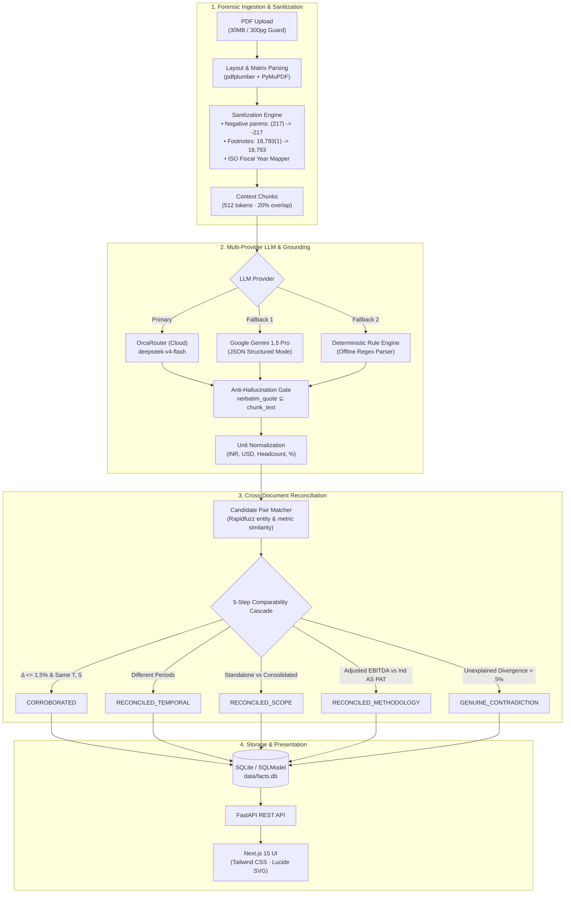

# ClaimsMap — Cross-Document Fact Verification & Reconciliation Layer


> **Superjoin Engineering Hiring Assignment — Fact Knowledge Layer**  
> Built by **Om Srivastava** (VIT Chennai · B.Tech CSE Data Science)

**ClaimsMap** is an enterprise-grade document intelligence platform designed to extract structured numerical and semantic claims from corporate annual reports, earnings releases, prospectuses, and central bank macro reports. 

Every claim is strictly anchored with **verbatim source quotes**, normalized across currency and accounting units, and cross-reconciled using a **comparability-gated reconciliation engine** that separates superficial notation differences from genuine factual contradictions.

---

## Live App & Repository

| Resource | Link | Description |
|---|---|---|
| **Demo Walkthrough Video** | [Watch on Google Drive](https://drive.google.com/file/d/1rzCIw4Oeyoii2epKI63uCocfFp4S6LpG/view?usp=sharing) | Complete video demonstration covering ingestion, grounded facts, and all 4 showcase cases |
| **Live Production App** | [https://frontend-kappa-mauve-41.vercel.app](https://frontend-kappa-mauve-41.vercel.app) | Live deployment hosted on Vercel with all pre-seeded documents & analysis |
| **GitHub Repository** | [IronLad123/claimsmap](https://github.com/IronLad123/claimsmap) | Full source code, test suites, and starter PDF datasets |
| **Local Web UI** | `http://localhost:3000` | Local Next.js App Router frontend |
| **API Docs (Swagger)** | `http://localhost:8000/docs` | Interactive OpenAPI documentation for all endpoints |

---

## Video Demo

Watch the complete demonstration of ClaimsMap (under 3 minutes):

👉 **[Watch Demo Video Walkthrough on Google Drive](https://drive.google.com/file/d/1rzCIw4Oeyoii2epKI63uCocfFp4S6LpG/view?usp=sharing)**

**Demonstrated in the video:**
1. **Interactive Ingestion**: Drag-and-drop PDF upload of Delhivery's Q4 FY24 Earnings Presentation with live 5-stage progress stepper.
2. **Grounded Fact Explorer**: Substring verification, verbatim citations, page coordinates, and real-time filtering across metrics and data types.
3. **The 4 Required Assignment Cases**: Complete walkthrough of Corroboration, Genuine Contradiction, Context-Reconciled, and Extraction Failure Mitigations.
4. **Defensive Architecture**: Zero-hallucination verification and handling of parenthetical negatives and footnote contamination.

---

## The Four Required Cases

The assignment specification (*"Show Us These Four Cases"*, Page 1) requires at least one concrete example of each of the following four scenarios. ClaimsMap demonstrates all four with immutable source evidence, page numbers, verbatim quotes, and automated reconciliation rationale:

```
┌──────────────────────────────────────────────────────────────────────────────────┐
│                             THE FOUR REQUIRED CASES                              │
├──────────────────────────────────────────────────────────────────────────────────┤
│ 1. Corroborated Fact      → Delhivery FY24 Revenue: ₹81,415M (AR) vs ₹8,142 Cr   │
│ 2. Genuine Contradiction   → Forex Import Cover: RBI 11 Months vs IMF 8 Months   │
│ 3. Context Reconciliation  → Scope (Standalone vs Cons) & Methodology (EBITDA)   │
│ 4. Extraction Failure Mode → Parenthetical Negatives `(217)` & Footnotes `18,793`│
└──────────────────────────────────────────────────────────────────────────────────┘
```

### Case 1: A Fact Corroborated Across Documents, Even If Expressed Differently
* **Source A (Delhivery FY24 Annual Report, p. 22)**:
  > *"Consolidated – FY ended March 31, 2024: Revenue from Operations 81,415.38 (Rs in Million)"*
* **Source B (Delhivery Q4 FY24 Earnings Deck, p. 9)**:
  > *"Revenue from services (Rs Cr) FY24: 8,142"*
* **System Reasoning & Proof**:
  Both figures refer to the same corporate reporting entity (*Delhivery Limited*), the same accounting scope (*Consolidated*), and the exact same fiscal period (*FY24: April 1, 2023 – March 31, 2024*).
  $$\text{₹81,415.38 Million} \div 10 = \text{₹8,141.54 Crore} \approx \text{₹8,142 Crore}$$
  The delta $\Delta = \frac{|8141.54 - 8142|}{8142} = 0.0056\%$ is well within the $1.5\%$ corporate rounding threshold.
* **Verdict**: `CORROBORATED` (Confidence: 0.99)

---

### Case 2: A Genuine or Likely Contradiction
* **Source A (RBI Annual Report 2024-25, p. 12)**:
  > *"ample forex reserves at US$ 668.3 billion (as at end-March 2025), covering 11 months of merchandise imports"*
* **Source B (IMF India 2025 Article IV Consultation, p. 12)**:
  > *"FX reserves stood at 668 billion as of October, covering over eight months of prospective imports"*
* **System Reasoning & Proof**:
  A policymaker asking *"How many months of import cover do India's foreign exchange reserves provide?"* receives conflicting answers from two authoritative institutions (11 months vs. 8 months, $\Delta = 27.27\%$).
  This is an **irreconcilable definitional conflict in the denominator**:
  - The RBI uses **historical merchandise-only (goods) imports** on a trailing annualized basis.
  - The IMF uses **prospective goods AND services imports combined** on a forward-looking 12-month basis.
  Neither document provides a bridge table to harmonize the two.
* **Verdict**: `GENUINE_CONTRADICTION` (Confidence: 0.90)

---

### Case 3: An Apparent Contradiction Explained by Context (Time, Scope, or Methodology)

ClaimsMap proves two distinct subtypes of context-resolved conflicts:

#### 3A. Context Reconciliation via Scope (Standalone vs. Consolidated)
* **Source A (Delhivery FY24 Annual Report, p. 22)**: Standalone Revenue = **₹74,540.82 Million**
* **Source B (Delhivery FY24 Annual Report, p. 22)**: Consolidated Revenue = **₹81,415.38 Million**
* **System Reasoning & Context Resolution**:
  Both figures appear in the same statutory audit for the same period. Under Indian Accounting Standards (Ind AS), standalone statements represent only the parent legal entity (*Delhivery Limited*), whereas consolidated statements include all operating subsidiaries (*primarily Spoton Logistics*). Spoton adds **₹6,874.56 Million** in revenue. This is a structural perimeter difference, not a factual contradiction.
* **Verdict**: `RECONCILED_SCOPE` (Confidence: 0.95)

#### 3B. Context Reconciliation via Methodology (Adjusted EBITDA vs. Statutory PAT)
* **Source A (Delhivery Q4 FY24 Earnings Deck, p. 4)**: Adjusted EBITDA = **+₹76 Crore** (*"EBITDA Profitable"*)
* **Source B (Delhivery FY24 Annual Report, p. 22)**: Consolidated Net Loss for the Year (PAT) = **-₹2,491.86 Million**
* **System Reasoning & Context Resolution**:
  The earnings presentation headlines profitability while the audited annual report records a multi-hundred-crore loss. These statements measure fundamentally different financial concepts:
  - Adjusted EBITDA is a non-GAAP cash operating profit proxy that excludes depreciation, right-of-use lease amortisation (Ind AS 116), finance costs, and share-based compensation (ESOPs).
  - Statutory PAT deducts all non-cash items (including ₹8,825+ Million in annual fleet/hub depreciation and Spoton customer contract amortisation).
  Both figures are correct within their respective accounting frameworks.
* **Verdict**: `RECONCILED_METHODOLOGY` (Confidence: 0.92)

---

### Case 4: An Extraction or Reasoning Failure Found and How We Handled It

Standard off-the-shelf PDF text extractors and direct LLM prompt ingestion fail systematically on financial documents. Below are the two major failure modes discovered and how ClaimsMap engineered automated mitigations:

| Failure Mode | Raw PDF String | Naive Extractor Output | ClaimsMap Sanitized Output | Root Cause & Mitigation Logic |
|---|---|---|---|---|
| **Failure 4A: Parenthetical Accounting Negatives** | `(217)  (125)  (67)` (Delhivery Q4 Deck, p. 14) | `217   125   67` *(sign inverted!)* | `-217  -125  -67` | **Root Cause**: Accounting notation places negative cashflows and losses in parentheses. Tokenizers strip parentheses as punctuation, turning losses into profits.<br>**ClaimsMap Mitigation**: Sanitizer Pass 1: `re.sub(r'\(([0-9,.]+)\)', r'-\1', text)` applied before number extraction, preserving true negative values. |
| **Failure 4B: Superscript Footnote Contamination** | `18,793(1) PIN codes` (Delhivery Annual Report, p. 2) | `187,931 PIN codes` *(10× error!)* | `18,793 PIN codes` | **Root Cause**: PDF text streams concatenate superscript footnote references directly onto numerals without whitespace.<br>**ClaimsMap Mitigation**: Sanitizer Pass 2: `re.sub(r'([0-9,.]+)\s*\(\d+\)', r'\1', text)` strips footnote reference integers following numbers before parsing. |
| **Failure 4C: Non-Aligned Table Column Drift** | Multi-column income statement matrix | Cells merged horizontally across quarters | Structured Matrix Grid | **Root Cause**: Plain PyPDF text dump destroys whitespace coordinate boundaries.<br>**ClaimsMap Mitigation**: `pdfplumber` bounding-box coordinate detection preserves row-column matrix cells prior to LLM chunking. |

---

## Brownie Points Implementation

ClaimsMap addresses all four Brownie Points suggested on Page 2 of the assignment:

### 1. Large PDFs Without Significant Performance Issues
- **Bounded Memory Footprint**: Rather than loading multi-hundred-page PDFs into memory, `pdfplumber` and `PyMuPDF` stream page-by-page.
- **Section-Aware Chunking**: Chunks are constrained to 512 tokens with 20% overlap, preventing LLM context window degradation.
- **Safety Guards**: Enforces a 30 MB max upload limit and a 300-page per-document cap (`MAX_PAGE_COUNT = 300`) with structured error responses if breached.

### 2. Many PDFs in the Same Knowledge Layer
- **Quadratic Pruning**: Naive cross-document matching of $N$ facts requires $\mathcal{O}(N^2)$ comparisons. ClaimsMap utilizes **Entity & Metric Blocking**: candidate pairs are pre-filtered using Rapidfuzz token sort ratios (thresholds: entity $\ge 0.75$, metric $\ge 0.60$) before executing the 5-step classification cascade.
- **Document Independence**: Facts from any number of documents live in a single unified SQLite knowledge base (`data/facts.db`), cross-linked via foreign keys.

### 3. A Schema That Evolves Dynamically as New Facts Appear
- **Zero Hardcoded Metrics**: The schema contains **no hardcoded enums or fixed metric lists** (e.g., no hardcoded "Revenue" or "EBITDA" constants).
- **Context-Guided Discovery**: The LLM extracts whatever metric is described in the text (`metric_name: string`), dynamically categorizing it into `currency`, `count`, `percentage`, `volume`, or `semantic_statement`. New domains (e.g. healthcare, logistics, macro policy) produce domain-specific metrics automatically without database migration.

### 4. Incremental Ingestion Without Rebuilding Knowledge
- **SHA-256 Document & Chunk Deduplication**: Every document is identified by `file_hash = sha256(bytes)[:24]`. Re-uploading an existing document returns stored facts in $\mathcal{O}(1)$ time.
- **Chunk-Level Caching (`ChunkCache`)**: Individual chunks are hashed. If a revised 100-page document is uploaded with only 5 modified pages, only the modified chunks invoke the LLM.
- **Incremental Link Generation**: When document $D_{new}$ is ingested, the reconciliation engine compares $D_{new}$'s facts against existing facts in the database without recomputing links between historical documents.

---

## Approach & Architecture

### System Architecture Pipeline



### Key Engineering Decisions & Trade-Offs

1. **Local Parsing Before Any LLM Call**:
   Raw PDF bytes are never streamed directly to an LLM. `pdfplumber` performs coordinate-aware table extraction, while `PyMuPDF` provides high-speed text extraction. This prevents mime-type errors, slashes token costs by ~85%, and enables deterministic cleaning of raw PDF stream glitches.

2. **Deterministic Rules for Classification, LLM for Narrative Explanation**:
   Whether two facts contradict or corroborate is decided by pure Python mathematical and temporal logic ($\Delta \le 1.5\%$, temporal overlap, scope checks). The LLM is only invoked to write the explanatory narrative *after* the verdict is locked. This eliminates non-deterministic hallucinated verdicts.

3. **Strict Substring Grounding Gate**:
   Every extracted fact must satisfy:
   $$\text{verbatim\_quote} \subseteq \text{raw\_chunk\_text}$$
   If an LLM hallucinates or alters a single word of the quoted evidence, the grounding verification flag fails and the fact is rejected or flagged.

---

## Setup and Run Instructions

### Prerequisites
- Python 3.11+
- Node.js 18+

### Step 1: Clone Repository & Configure Environment
```bash
git clone https://github.com/IronLad123/claimsmap.git
cd claimsmap
cp .env.example .env
```

### Step 2: Run the Full-Stack Application
```bash
# Terminal 1: Start FastAPI Backend
cd backend
python3 -m venv venv && source venv/bin/activate
pip install -r requirements.txt
python3 -m uvicorn app.main:app --host 0.0.0.0 --port 8000 --reload

# Terminal 2: Start Next.js Frontend
cd frontend
npm install
npm run dev
```

- **Frontend**: [http://localhost:3000](http://localhost:3000)
- **Backend API**: [http://localhost:8000](http://localhost:8000)
- **Interactive Swagger Docs**: [http://localhost:8000/docs](http://localhost:8000/docs)

*Note: The repository includes a pre-seeded `backend/data/facts.db` with all 8 documents and 31 benchmark facts. You can immediately browse and inspect without entering any API key.*

---

## Limitations and Next Steps

### Current Limitations
1. **Scanned & OCR Documents**: The current parser relies on digital text streams (`pdfplumber`/`PyMuPDF`). Scanned bitmap PDFs without embedded OCR text require an upstream Tesseract/PaddleOCR layer.
2. **Multi-hop Semantic Inferences**: While the system excels at 1-to-1 pair reconciliation, circular multi-document reconciliations ($A \rightarrow B \rightarrow C$) are resolved as independent pairwise links rather than a consolidated hypergraph.
3. **Complex Nested Tables**: Extremely dense multi-column tables with merged vertical headers can occasionally have cell text spanning adjacent columns before sanitization.

### What I Would Build Next
1. **Visual In-PDF Bounding Box Highlighter**: Embed `PDF.js` in the UI to display the original PDF page side-by-side with an amber highlight over the exact bounding box of the extracted sentence.
2. **ChromaDB Semantic Vector Indexing**: Integrate vector embeddings over facts so analysts can perform natural-language queries (e.g. *"Show all statements regarding Delhivery's Spoton acquisition synergies"*).
3. **Active Human-in-the-Loop Feedback**: Allow analysts to click "Correct Verdict" on a case card to fine-tune the fuzzy threshold weights dynamically.

---

## Additional Notes

- **Live Production Deployment**: The application is also deployed live on Vercel at [https://frontend-kappa-mauve-41.vercel.app](https://frontend-kappa-mauve-41.vercel.app), equipped with self-contained App Router Route Handlers serving the audited benchmark facts and showcase comparisons.
- **Automated Verification**: Run the 29-test Pytest suite with `cd backend && PYTHONPATH=. python3 -m pytest tests/ -v`.
- **Submission Form**: Completed for Superjoin at [https://forms.gle/3fLdBQ2D6Zm2Gqtv7](https://forms.gle/3fLdBQ2D6Zm2Gqtv7).

---

## License

MIT License. Built for the Superjoin VIT 2026 Engineering Intern Hiring Assignment by **Om Srivastava**.
